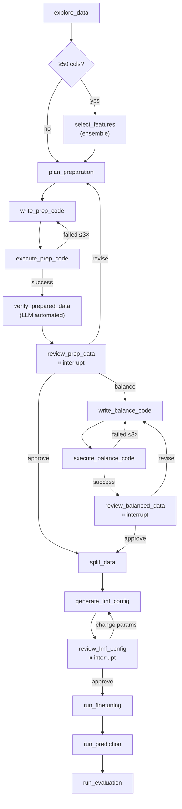

# Auto LLM Predictor

Automatically build a fine-tuned LLM predictor from any CSV dataset. Powered by [LangGraph](https://github.com/langchain-ai/langgraph), the pipeline analyzes your data, generates preparation code, fine-tunes a language model via [LlamaFactory](https://github.com/hiyouga/LLaMA-Factory), and evaluates predictions — all with human-in-the-loop review at critical checkpoints.

## Pipeline



| Stage | What it does |
|-------|-------------|
| **explore_data** | Profiles the CSV and uses an LLM to identify the target column, task type, and label mapping. **Verifies header alignment** if `--test-csv` is provided |
| **select_features** | Ensemble feature selection for high-dimensional data (≥50 columns): variance filtering → correlation ranking → mutual information → Random Forest importance → average-rank aggregation |
| **plan_preparation** | LLM decides instruction template, input format, balancing strategy, and data cleaning steps |
| **write_prep_code** | LLM generates a self-contained Python script to convert CSV → `all_data.json` (+ `test_data.json` if test CSV provided) |
| **execute_prep_code** | Runs the generated script; retries up to 3× on failure with error feedback |
| **verify_prepared_data** | LLM examines random samples from the output JSONs to verify Alpaca format, label consistency, and cross-split terminology |
| **review_prep_data** | ⏸ Human review of prepared data (features, dropped features, samples, distributions) + LLM critique |
| **write_balance_code** | LLM generates a script to balance data (oversample/undersample) |
| **execute_balance_code** | Runs the balancing script; retries up to 3× on failure |
| **review_balanced_data** | ⏸ Human review of class distributions after balancing |
| **split_data** | Deterministic train/test split (stratified), or direct assignment if `--test-csv` is provided |
| **generate_lmf_config** | Creates LlamaFactory YAML configs for training and prediction |
| **review_lmf_config** | ⏸ Human review of hyperparameters before fine-tuning |
| **run_finetuning** | Executes `llamafactory-cli train` (output streamed live) |
| **run_prediction** | Runs prediction on train and test splits (output streamed live) |
| **run_evaluation** | Computes accuracy, F1, confusion matrix via scikit-learn |

## Installation

Requires Python ≥ 3.11.

```bash
# Core dependencies only
pip install -e .

# With LlamaFactory for fine-tuning (includes torch, transformers, etc.)
pip install -e ".[train]"
```

> **Note:** If you already have [LlamaFactory](https://github.com/hiyouga/LLaMA-Factory) installed in your environment, the base install is sufficient.

## Usage

```bash
# Minimal — auto-detect target column
auto-llm-predictor --csv data/my_dataset.csv --model Qwen/Qwen2.5-7B-Instruct

# Specify target and output directory
auto-llm-predictor --csv data/patients.csv --target response \
    --model Qwen/Qwen2.5-7B-Instruct --output output/exp1

# Use a different agent LLM
auto-llm-predictor --csv data/patients.csv --model Qwen/Qwen2.5-7B-Instruct \
    --agent-model gpt-4o \
    --agent-api-base https://api.openai.com/v1 \
    --agent-api-key ...

# Resume a past experiment — re-split with a different ratio
auto-llm-predictor --csv data/patients.csv --model Qwen/Qwen2.5-7B-Instruct \
    --output output/exp1 --start-from split --test-ratio 0.3

# Resume — jump straight to config review with new hyperparameters
auto-llm-predictor --csv data/patients.csv --model Qwen/Qwen2.5-7B-Instruct \
    --output output/exp1 --start-from config --epochs 5 --lora-rank 128
```

### Environment Configuration

Endpoints and model IDs can be set in a `.env` file (loaded automatically):

```env
openAI_endpoint=192.168.x.y:1234
auth_key=your-key
agent_LLM=gpt-oss-20b
coder_LLM=qwen3-coder-30b-a3b-instruct
```

CLI flags override `.env` values when both are specified.

### CLI Options

| Flag | Default | Description |
|------|---------|-------------|
| `--csv` | *(required)* | Path to the raw CSV file |
| `--model` | *(required)* | HuggingFace model ID for fine-tuning |
| `--target` | *(auto-detect)* | Target column name |
| `--output` | `output/<csv_stem>` | Output directory |
| `--test-csv` | *(none)* | Optional separate test CSV (skips splitting) |
| `--test-ratio` | `0.2` | Test split ratio (ignored when `--test-csv` is set) |
| `--start-from` | *(none)* | Resume from step: `review_prep`, `split`, or `config` |
| `--agent-api-base` | env: `openAI_endpoint` | OpenAI-compatible API base URL |
| `--agent-api-key` | env: `auth_key` | API key for the LLM endpoint |
| `--agent-model` | env: `agent_LLM` | Model ID for reasoning/planning |
| `--coder-model` | env: `coder_LLM` | Model ID for code generation (falls back to agent-model) |
| `--agent-temperature` | `0.2` | Sampling temperature |
| `-v` / `--verbose` | off | Enable debug logging |

**Training Hyperparameters:**

| Flag | Default | Description |
|------|---------|-------------|
| `--lora-rank` | `64` | LoRA rank |
| `--lora-alpha` | `128` | LoRA alpha |
| `--use-dora` | off | Enable DoRA adapter |
| `--cutoff-len` | `2048` | Max input token length |
| `--epochs` | `3.0` | Number of training epochs |
| `--learning-rate` | `2.0e-5` | Learning rate |
| `--batch-size` | `2` | Per-device train batch size |
| `--grad-accumulation` | `8` | Gradient accumulation steps |
| `--logging-steps` | `10` | Logging interval in steps |
| `--save-steps` | `500` | Checkpoint save interval |
| `--quantization-bit` | *(none)* | Quantization bits (`4` or `8`) |
| `--flash-attn` | `fa2` | Flash attention (`auto`, `fa2`, `disabled`) |
| `--precision` | `bf16` | Training precision (`bf16` or `fp16`) |

## Human-in-the-Loop Review

The pipeline pauses at three checkpoints using LangGraph's `interrupt()` API:

### Data Review (`review_prep_data`)

After data preparation and automated LLM verification, you see a summary of features, dropped features (on a single line for easy copy-pasting), data sizes, class distribution, a sample entry, and an **Automated Data Verification (LLM Critique)** section. Respond with:

- **`approve`** — Proceed to train/test split (or config generation after balancing)
- **`balance`** / **`oversample`** / **`undersample`** — Proceed to balance training data
- **Feedback** — loops back to re-plan and regenerate. Supported patterns:

```
drop features: patient_id, smoker
add features: weight, height
keep only features: age, bmi, cholesterol
use undersample
test_ratio: 0.3
change target mapping: 0: No, 1: Yes
change instruction to: Predict whether the patient will respond to treatment
```

### Balance Review (`review_balanced_data`)

After data balancing, you see the class distribution before and after. Respond with:

- **`approve`** — Proceed to train/test split
- **Feedback** — loops back to re-balance with a different strategy:

```
use undersample instead
use oversample
balance_strategy: none
```

### Config Review (`review_lmf_config`)

Before fine-tuning, you see a highlighted table of key training parameters and all LlamaFactory YAML configs. Respond with:

- **`approve`** — start fine-tuning
- **Key-value overrides** — merged into config and YAMLs are regenerated for re-review:

```
lora_rank: 32, num_train_epochs: 5
learning_rate: 1.0e-5
per_device_train_batch_size: 4
cutoff_len: 4096
```

**Training-only parameters:** `lora_rank`, `lora_alpha`, `lora_dropout`, `lora_target`, `use_dora`, `num_train_epochs`, `learning_rate`, `lr_scheduler_type`, `warmup_ratio`, `per_device_train_batch_size`, `gradient_accumulation_steps`, `save_steps`, `save_strategy`, `save_total_limit`, `logging_steps`, `val_size`, `eval_steps`, `plot_loss`, `report_to`, `ddp_timeout`

**Shared parameters (all YAMLs):** `cutoff_len`, `bf16`, `fp16`, `flash_attn`, `quantization_bit`, `per_device_eval_batch_size`, `preprocessing_num_workers`, `template`

## Feature Selection

For high-dimensional datasets (≥50 feature columns), the pipeline automatically runs an ensemble feature selection before LLM-based planning:

1. **Variance filtering** — removes near-constant features
2. **Correlation ranking** — Pearson |r| with target
3. **Mutual information** — non-linear dependency score
4. **Random Forest importance** — tree-based feature importance
5. **Average-rank aggregation** — combines all methods

Results are saved to `<output_dir>/feature_selection/feature_rankings.csv`.

## Output Structure

```
output/<csv_stem>/
├── data/
│   ├── all_data.json            # Full dataset (Alpaca format, pre-split)
│   ├── balanced_data.json       # Balanced training data (if oversample/undersample used)
│   ├── test_data.json           # (only if --test-csv provided)
│   ├── train.json               # Training split (created by split_data)
│   ├── test.json                # Test split (created by split_data)
│   └── dataset_info.json        # LlamaFactory dataset registry
├── scripts/
│   ├── prepare_data.py          # LLM-generated data prep script
│   └── balance_data.py          # LLM-generated balancing script
├── feature_selection/           # (high-dimensional datasets only)
│   ├── selected_features.txt
│   └── feature_rankings.csv
├── .pipeline_state.json         # Saved state for --start-from
├── run_20250220_143015/         # Timestamped per training run
│   ├── configs/
│   │   ├── train.yaml
│   │   ├── predict_train.yaml
│   │   └── predict_test.yaml
│   ├── sft/                     # LoRA adapter + training logs
│   ├── predict_train/           # Predictions on training set
│   ├── predict_test/            # Predictions on test set
│   └── evaluation/
│       └── results.json         # Accuracy, F1, confusion matrix
└── run_20250221_091200/         # Next run — past runs preserved
    └── ...
```

## Project Structure

```
src/auto_llm_predictor/
├── main.py                     # CLI entry point with interrupt/resume loop
├── graph.py                    # LangGraph pipeline definition
├── state.py                    # PipelineState TypedDict schema
├── checkpoint.py               # Save/load state for --start-from
├── utils.py                    # CSV profiling, script execution, YAML I/O
├── prompts/
│   ├── explore.py              # Data analysis prompts
│   ├── plan.py                 # Preparation planning prompts
│   ├── codegen.py              # Code generation prompts
│   ├── verify.py               # Automated data verification prompts
│   └── balance.py              # Balancing code generation prompts
└── nodes/
    ├── explore.py              # Profile CSV → LLM identifies target & task
    ├── feature_selection.py    # Ensemble feature selection (high-dim)
    ├── plan.py                 # LLM creates data preparation plan
    ├── codegen.py              # LLM generates prepare_data.py
    ├── execute.py              # Runs script, validates output, retries
    ├── verify.py               # LLM-based automated dataset verification
    ├── balance.py              # LLM generates & runs balance_data.py
    ├── review.py               # Human-in-the-loop review breakpoints
    ├── split.py                # Deterministic train/test splitting
    ├── config.py               # Generates LlamaFactory YAMLs (with run_dir reuse)
    ├── finetune.py             # Runs llamafactory-cli train
    ├── predict.py              # Runs prediction on train/test
    ├── evaluate.py             # Robust classification metrics (handles raw strings)
```

## Dependencies

- **langgraph** ≥ 0.2 — pipeline orchestration & interrupt support
- **langchain-core / langchain-openai** ≥ 0.3 — LLM integration
- **pandas** ≥ 2.0 — data profiling
- **scikit-learn** ≥ 1.3 — feature selection, train/test splitting & evaluation metrics
- **numpy** ≥ 1.24 — numerical operations
- **pyyaml** ≥ 6.0 — YAML config generation
- **python-dotenv** ≥ 1.0 — `.env` configuration loading
- **typing-extensions** ≥ 4.0 — type annotations
- **[LlamaFactory](https://github.com/hiyouga/LLaMA-Factory)** ≥ 0.9 — fine-tuning & prediction (optional: `pip install -e ".[train]"`)
