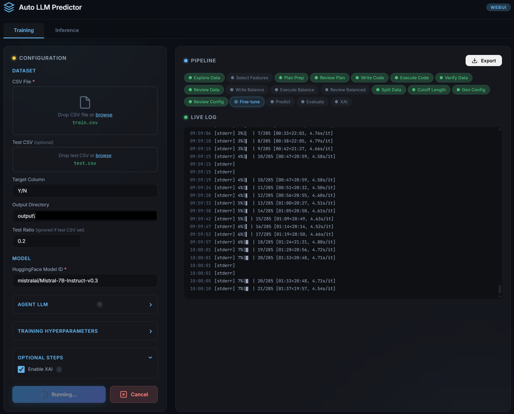
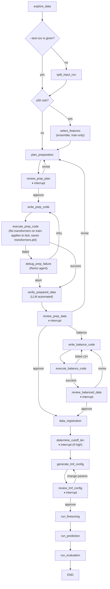

# Auto LLM Predictor

[](https://opensource.org/licenses/Apache-2.0)
[](https://www.python.org/downloads/release/python-3110/)

Automatically build a fine-tuned LLM predictor from any CSV dataset. Powered by [LangGraph](https://github.com/langchain-ai/langgraph), the pipeline analyzes your data, generates preparation code, fine-tunes a language model via [LlamaFactory](https://github.com/hiyouga/LLaMA-Factory), and evaluates predictions — all with human-in-the-loop review via **CLI or Web UI**.



## Core Features

- **Agentic Data Exploration**: A ReAct agent with sandboxed tools (`sample_rows`, `column_stats`, `value_counts`, `correlation_matrix`, `run_pandas_query`) investigates the CSV before identifying the target and task type.
- **Self-Correcting Code Agent**: On script failure, a `debug_prep_failure` ReAct agent diagnoses the root cause before retrying — falls back to single-shot diagnosis for models without tool calling.
- **Local Model Support**: `--model` accepts a local directory path in addition to HuggingFace IDs. Template is auto-detected from `config.json`; use `--template` to override.
- **Post-Training Inference**: Batch or interactive single-sample predictions via CLI or Web UI, without re-running the pipeline.
- **Baseline Evaluation**: Evaluate any non-finetuned model on the same prepared data to compare against the finetuned adapter — via CLI or Web UI.
- **Explainable AI (XAI)**: Token-level explanations via SHAP, TransformerLens logit attribution, and attention fallback.
- **Smart Data Handling**: Ensemble feature selection for high-dim data (≥50 cols); intelligent class balancing.
- **Human-in-the-Loop**: Five interrupt checkpoints to override plans, code, or hyperparameters.
- **Web UI**: Dashboard with live SSE logging, inline JSON/YAML editors, artifact export, and Inference / XAI / Baseline tabs.

## Pipeline


```mermaid
graph TD
    A["explore_data"] --> SI{"--test-csv is given?"}
    SI -->|yes| B{"≥50 cols?"}
    SI -->|no| SYI["split_input_csv"] --> B
    B -->|yes| FS["select_features<br/>(ensemble, train-only)"]
    B -->|no| C["plan_preparation"]
    FS --> C
    C --> RP["review_prep_plan<br/>⏸ interrupt"]
    RP -->|approve| D["write_prep_code"]
    RP -->|revise| C
    D --> E["execute_prep_code<br/>(fits transformers on train,<br/>applies to test, saves transformers.pkl)"]
    E -->|failed| DBG["debug_prep_failure<br/>(ReAct agent)"]
    DBG -->|retry| D
    DBG -->|abort| V
    E -->|success| V["verify_prepared_data<br/>(LLM automated)"]
    V --> R1["review_prep_data<br/>⏸ interrupt"]
    R1 -->|approve| S["data_registration"]
    R1 -->|balance| WB["write_balance_code"]
    R1 -->|revise| C
    WB --> EB["execute_balance_code"]
    EB -->|failed ≤3×| WB
    EB -->|success| RB["review_balanced_data<br/>⏸ interrupt"]
    RB -->|approve| S
    RB -->|revise| WB
    S --> CL["determine_cutoff_len<br/>⏸ interrupt (if high)"]
    CL --> F["generate_lmf_config"]
    F --> R2["review_lmf_config<br/>⏸ interrupt"]
    R2 -->|approve| G["run_finetuning"]
    R2 -->|change params| F
    G --> H["run_prediction"]
    H --> I["run_evaluation"]
    I --> DONE["END"]
```

| Stage | What it does |
|-------|-------------|
| **explore_data** | ReAct agent with sandboxed tools iteratively investigates the CSV, then identifies target column, task type, and label mapping. Verifies header alignment when `--test-csv` is provided. |
| **split_input_csv** | Stratified train/test split of the input CSV at the start of the pipeline so that every later step sees only training data. No-op when `--test-csv` is provided. |
| **select_features** | Ensemble for high-dim data (≥50 cols): variance filter → correlation → mutual information → Random Forest → average-rank aggregation. Run on training data only. |
| **plan_preparation** | LLM decides instruction template, input format, balancing strategy, and cleaning steps |
| **review_prep_plan** | ⏸ Human reviews features, instruction, target mapping, balance strategy. Accepts `approve`, feedback text, or a raw JSON override. |
| **write_prep_code** | LLM generates a Python script with a stable CLI (`--input-csv`, `--test-csv`, `--output-dir`, `--predict-only`) that fits transformers on train, transforms test, and persists fitted transformers to `transformers.pkl` |
| **execute_prep_code** | Runs the script with the train + test CSV paths; validates that `all_data.json`, `test_data.json`, and `transformers.pkl` were produced |
| **debug_prep_failure** | ReAct agent diagnoses failures (reads files, runs snippets), produces a diagnosis for the next codegen attempt. Routes to retry or abort. |
| **verify_prepared_data** | LLM checks random samples for Alpaca format, label consistency, and cross-split terminology |
| **review_prep_data** | ⏸ Human reviews data stats and LLM critique. Can `approve`, request balancing, or give feedback to re-plan. |
| **write/execute_balance_code** | LLM generates and runs a balancing script (retry on failure). Operates on training data only. |
| **review_balanced_data** | ⏸ Human reviews class distributions before/after balancing |
| **data_registration** | Copies `all_data.json` / `test_data.json` to the canonical `train.json` / `test.json` filenames and writes the LlamaFactory `dataset_info.json` registry |
| **determine_cutoff_len** | ⏸ Analyzes token lengths; pauses for percentile choice if max exceeds 10k tokens |
| **generate_lmf_config** | Creates LlamaFactory YAML configs for training and prediction |
| **review_lmf_config** | ⏸ Human reviews hyperparameters. Accepts `approve`, key-value overrides, or a raw YAML override. |
| **run_finetuning** | `llamafactory-cli train` with live output; auto-resumes from latest checkpoint on failure |
| **run_prediction / run_evaluation** | Runs predictions; computes accuracy, F1, confusion matrix |

## Installation

Requires Python ≥ 3.11.

```bash
pip install -e .                  # Core only
pip install -e ".[train]"         # + LlamaFactory (fine-tuning)
pip install -e ".[webui]"         # + FastAPI Web UI
pip install -e ".[ollama]"        # + Ollama native API support
pip install -e ".[xai]"           # + XAI (also requires [train])
```

> If LlamaFactory is already installed in your environment, the base install is sufficient.

## Usage

```bash
# Minimal
auto-llm-predictor --csv data.csv --model mistralai/Mistral-7B-Instruct-v0.3

# With target column and output dir
auto-llm-predictor --csv data.csv --target response \
    --model mistralai/Mistral-7B-Instruct-v0.3 --output output/exp1

# Separate agent LLM
auto-llm-predictor --csv data.csv --model mistralai/Mistral-7B-Instruct-v0.3 \
    --agent-model gpt-4o --agent-api-base https://api.openai.com/v1 --agent-api-key ...

# Resume from a checkpoint
auto-llm-predictor --csv data.csv --model mistralai/Mistral-7B-Instruct-v0.3 \
    --output output/exp1 --start-from register --test-ratio 0.3

# Local model (template auto-detected from config.json)
auto-llm-predictor --csv data.csv --model /models/Mistral-7B --template llama3

# Use Ollama as the agent LLM backend
auto-llm-predictor --csv data.csv --model mistralai/Mistral-7B-Instruct-v0.3 \
    --llm-provider ollama --agent-api-base http://localhost:11434 --agent-model gpt-oss:20b
```

### Web UI

```bash
auto-llm-predictor-webui   # http://localhost:8000
```

### Inference

```bash
# Batch
auto-llm-predictor-infer \
    --infer-output-dir output/my_dataset \
    --infer-run-dir output/my_dataset/run_20260307_120000 \
    --infer-csv data/new_data.csv

# Interactive single-sample (with optional XAI)
auto-llm-predictor-infer \
    --infer-output-dir output/my_dataset \
    --infer-run-dir output/my_dataset/run_20260307_120000 \
    --infer-single --infer-xai
```

Key inference flags: `--infer-csv`, `--infer-single`, `--infer-xai`, `--infer-precision` (`bf16`/`fp16`), `--infer-quantization-bit` (`4`/`8`), `--infer-flash-attn`.

### Baseline Evaluation

```bash
# Evaluate the training run's base model (no adapter) on the test split
auto-llm-predictor-baseline --output-dir output/my_dataset

# Evaluate a different model
auto-llm-predictor-baseline --output-dir output/my_dataset \
    --model Qwen/Qwen2.5-7B-Instruct

# Custom output directory, both splits
auto-llm-predictor-baseline --output-dir output/my_dataset \
    --model Qwen/Qwen2.5-7B-Instruct \
    --baseline-dir output/my_dataset/baseline_qwen \
    --splits test,train
```

Key baseline flags: `--model` (defaults to training run model), `--baseline-dir` (defaults to `output_dir/baseline_<model>/`), `--splits` (`test`, `train`, or `test,train`), `--precision` (`bf16`/`fp16`), `--quantization-bit` (`4`/`8`), `--flash-attn`.

### Standalone XAI

```bash
auto-llm-predictor-xai \
    --output-dir output/my_dataset \
    --run-dir output/my_dataset/run_20260307_120000
```

Key XAI flags: `--max-samples` (default `50`), `--precision` (`bf16`/`fp16`), `--quantization-bit` (`4`/`8`), `--flash-attn` (`auto`/`fa2`/`disabled`).

### Environment Configuration

```env
llm_provider=openai              # or "ollama" for Ollama native API
openAI_endpoint=192.168.x.y:1234 # host:port (no http:// prefix)
auth_key=your-key                # not required for Ollama
agent_LLM=gpt-oss-20b
coder_LLM=qwen3-coder-30b-a3b-instruct
```

CLI flags override `.env` values.

### CLI Options

| Flag | Default | Description |
|------|---------|-------------|
| `--csv` | *(required)* | Path to the raw CSV file |
| `--model` | *(required)* | HuggingFace model ID or local directory path |
| `--template` | *(auto-detect)* | LlamaFactory chat template (e.g. `llama3`, `qwen`, `mistral`) |
| `--target` | *(auto-detect)* | Target column name |
| `--output` | `output/<csv_stem>` | Output directory |
| `--test-csv` | *(none)* | Separate test CSV (skips the auto-split of the input CSV) |
| `--test-ratio` | `0.2` | Auto-split ratio when no `--test-csv` is provided |
| `--start-from` | *(none)* | Resume from: `review_prep`, `register`, or `config` |
| `--llm-provider` | `openai` | LLM backend: `openai` or `ollama` (env: `llm_provider`) |
| `--agent-api-base` | env: `openAI_endpoint` | API base URL (`http://host:port/v1` for openai, `http://host:port` for ollama) |
| `--agent-api-key` | env: `auth_key` | API key (not required for Ollama) |
| `--agent-model` | env: `agent_LLM` | Model for reasoning/planning |
| `--coder-model` | env: `coder_LLM` | Model for code generation |
| `--agent-temperature` | `0.2` | Sampling temperature |

**Training:**

| Flag | Default | Description |
|------|---------|-------------|
| `--auto-cutoff` | off | Auto-determine cutoff length from training data |
| `--cutoff-len` | `2048` | Max input token length |
| `--lora-rank` | `64` | LoRA rank |
| `--lora-alpha` | `128` | LoRA alpha |
| `--use-dora` | off | Enable DoRA |
| `--epochs` | `3.0` | Training epochs |
| `--learning-rate` | `2.0e-5` | Learning rate |
| `--batch-size` | `1` | Per-device train batch size |
| `--grad-accumulation` | `16` | Gradient accumulation steps |
| `--quantization-bit` | *(none)* | Quantization (`4` or `8`) |
| `--flash-attn` | `fa2` | Flash attention (`auto`, `fa2`, `disabled`) |
| `--precision` | `bf16` | Training precision |

| `--finetune-retries` | `3` | Max auto-resume attempts on fine-tuning failure |

## Human-in-the-Loop Review

Five interrupt checkpoints — respond with `approve`, feedback text, or a direct JSON/YAML override:

| Checkpoint | Supported feedback patterns |
|------------|---------------------------|
| **review_prep_plan** | `drop features: ...`, `add features: ...`, `change instruction to: ...`, `change target mapping: ...`, `use oversample` |
| **review_prep_data** | Same as above plus `keep only features: ...`, `balance` / `oversample` / `undersample` |
| **determine_cutoff_len** | `approve` / Enter, `p95` / `p90` / `p85` / `p80`, or a custom integer (e.g. `4096`) |
| **review_balanced_data** | `approve`, `use undersample instead`, `balance_strategy: none` |
| **review_lmf_config** | `lora_rank: 32`, `num_train_epochs: 5`, `learning_rate: 1.0e-5`, or any LlamaFactory key |

Direct JSON/YAML override: paste a complete JSON block (plan review) or YAML block (config review) to bypass the LLM and use it as-is.

## Output Structure

```
output/<csv_stem>/
├── data/
│   ├── train.csv / test.csv     # auto-split from --csv (skipped if --test-csv given)
│   ├── all_data.json / test_data.json
│   ├── train.json / test.json   # canonical names registered with LlamaFactory
│   ├── balanced_data.json       # (if balancing used)
│   ├── transformers.pkl         # fitted transformers for inference reuse
│   └── dataset_info.json
├── scripts/
│   ├── prepare_data.py          # accepts --input-csv / --test-csv / --output-dir / --predict-only
│   └── balance_data.py
├── feature_selection/           # (high-dim datasets only)
├── .pipeline_state.json         # state for --start-from
├── baseline_<model_name>/       # (via baseline evaluation)
│   ├── configs/                 # baseline predict YAML
│   ├── predict_test/ predict_train/
│   └── evaluation/results.json
└── run_<timestamp>/
    ├── configs/                 # train.yaml, predict_*.yaml
    ├── sft/                     # LoRA adapter + logs
    ├── predict_train/ predict_test/
    ├── evaluation/results.json
    └── xai/                     # (via standalone XAI)
```

## Project Structure

```
src/auto_llm_predictor/
├── main.py / webui.py / inference.py / xai.py / baseline.py / graph.py / state.py
├── checkpoint.py / utils.py
├── prompts/  explore.py  plan.py  codegen.py  debug.py  verify.py  balance.py
└── nodes/
    ├── explore.py          # ReAct agent: identifies target & task
    ├── split_input.py      # early stratified train/test split of the input CSV
    ├── feature_selection.py
    ├── plan.py / codegen.py / execute.py
    ├── debug.py            # ReAct agent: diagnoses failures
    ├── verify.py / balance.py / review.py / data_registration.py
    ├── config.py / finetune.py / predict.py / evaluate.py / explain.py
```

## License

Apache License 2.0. See [LICENSE](LICENSE).
